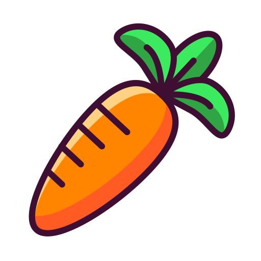

# Peas on Earth 

## Description 
This project maps Seattle's P-Patch community gardens alongside the city's light rail network to help residents more easily locate accessible, local, and nutritious food options. In a city where transit access and healthy food availability vary widely by neighborhood, this tool aims to bridge the gap by visualizing how close community members are to fresh produce grown in their own communities.

Project url (here)

## Favicon 

## Project Goal
Beyond producing a useful interactive map, the project also explores broader questions about food equity, transit connectivity, and the role of community gardens in supporting sustainable, community-driven food systems. Many Seattle residents, especially those in transit-dependent or under-resourced neighborhoods, face structural barriers to reaching affordable, healthy food.

By making this spatial information easy to explore, the project supports residents, planners, and community advocates in identifying gaps, proposing interventions, and celebrating the areas where local food access is already thriving.

## Main Functions

## Data Sources

## Applied Libaries & Web Services
Mapbox GL JS 

## Acknowledgements
Thanks to Professor Bo Zhao, for providing the foundation, framework, and inspiration that made this project possible.

Thanks to Hudson Dougan, for his unending support, guidance, and thoughtful feedback throughout every stage of the project.

Thanks to the City of Seattle and Sound Transit for maintaining and publishing civic spatial datasets that empower research and community engagement.

And lastly thanks to our peers and colleagues who contributed ideas, debugging help, constructive criticism, and additional perspectives.

## AI Disclosure
This project incorporates the use of AI tools including Claude.ai and ChatGPT for various components, such as generating the favicon, brainstorming the repository name and project title, and assisting with code structure and design iterations. We believe in transparent acknowledgment of all tools and collaborators that contribute to academic work.

