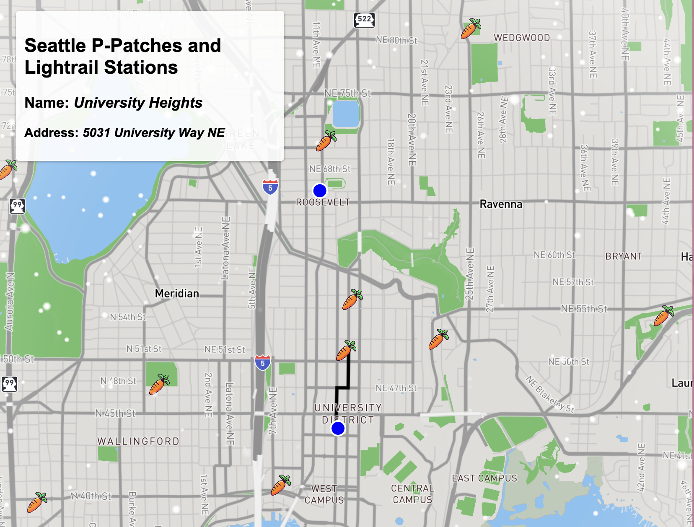
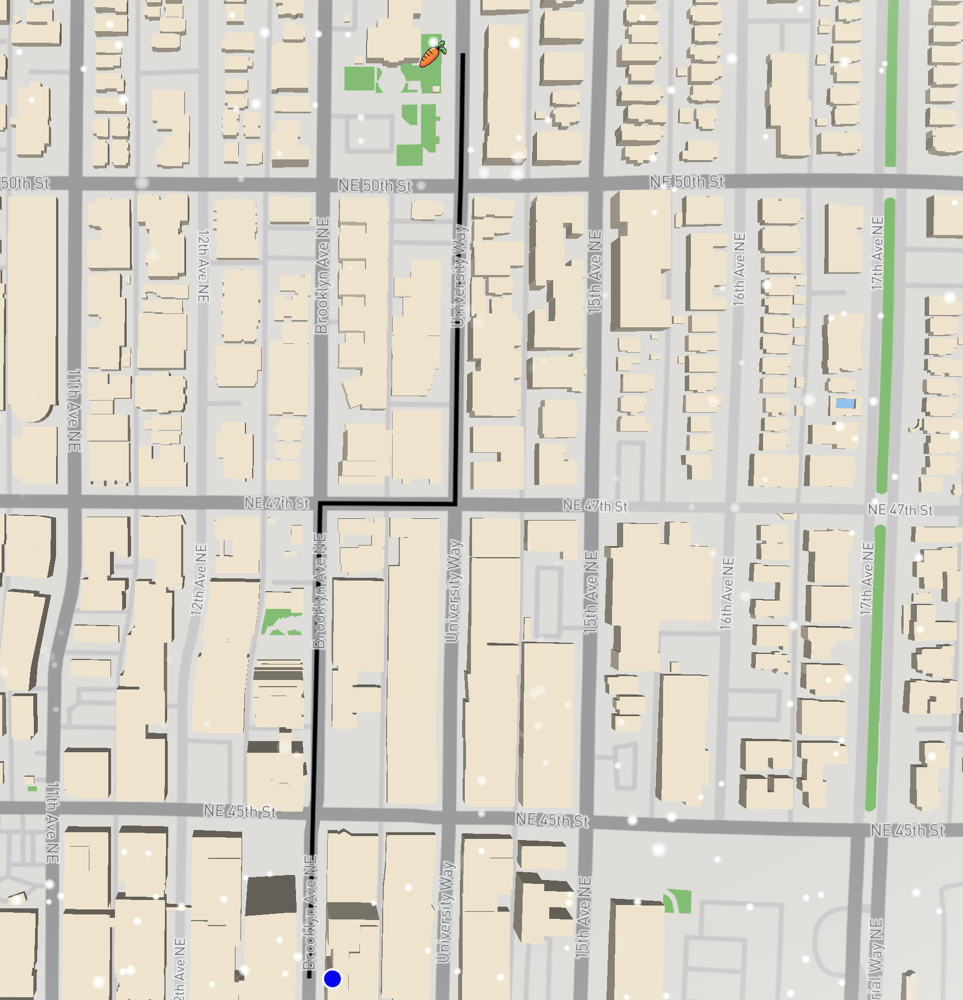
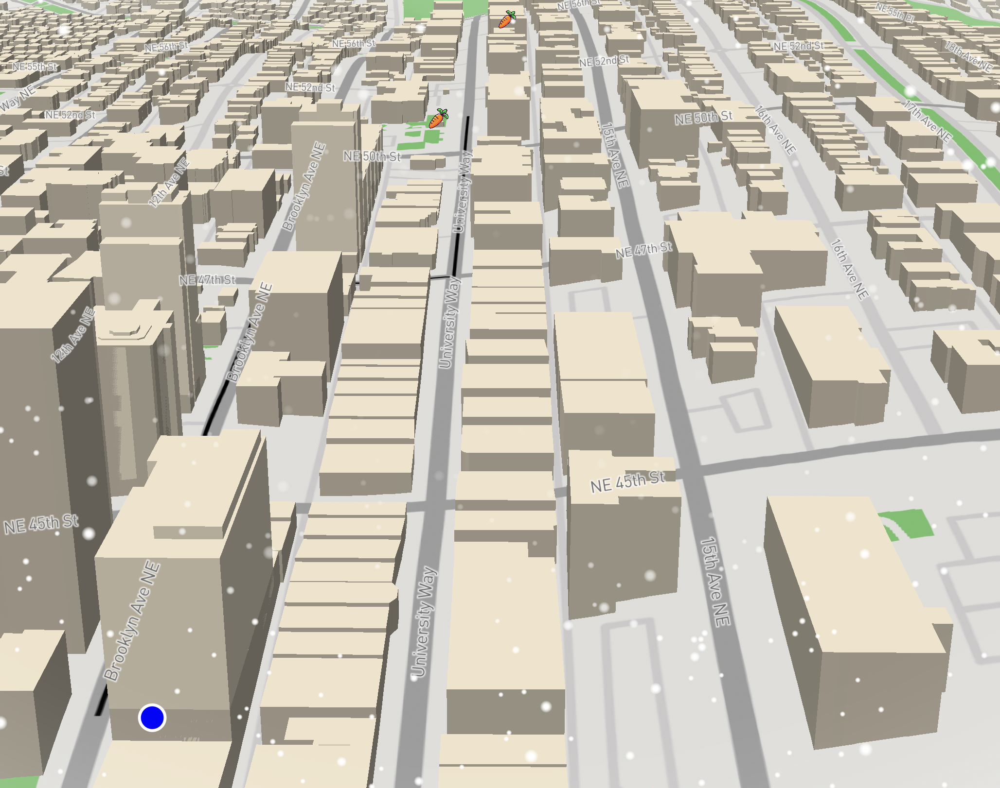
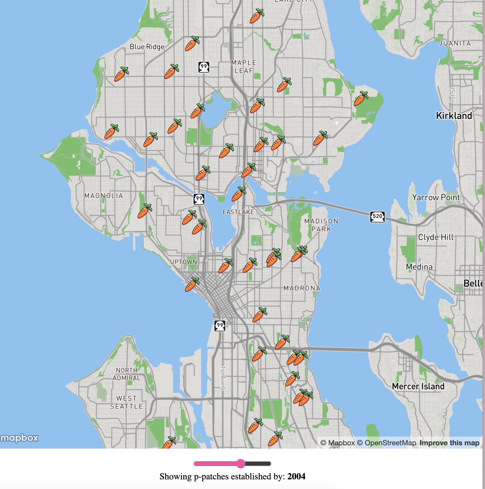

# Peas on Earth 

## Description 
This project maps Seattle's P-Patch community gardens alongside the city's light rail network to help residents more easily locate accessible, local, and nutritious food options. In a city where transit access and healthy food availability vary widely by neighborhood, the map aims to bridge the gap by visualizing how close community members are to fresh produce grown in their own communities. The goal is to provide something simple and user-friendly that highlights where these resources are located and how realistically people can reach them without needing a car. By showing community gardens and transit infrastructure together, the map makes it easier to see the everyday connections between mobility, food access, and neighborhood space. 

http://twickss.github.io/peas_on_earth

## Favicon 

## Project Goal
Beyond producing a useful interactive map, the project also explores broader questions about food equity, transit connectivity, and the role of community gardens in supporting sustainable, community-driven food systems. Many Seattle residents, especially those in transit-dependent or under-resourced neighborhoods, face structural barriers to reaching affordable, healthy food. These barriers aren’t always visible at first glance, but with our maps, you can clearly see how transit routes, neighborhood lines, and nearby green spaces influence people’s ability to reach healthy food.

By making this spatial information easy to explore, the project supports residents, planners, and community advocates in identifying gaps, proposing interventions, and celebrating the areas where local food access is already thriving. Our purpose is not just to map where P-Patches exist, but also to bring attention to how they function within a larger system of community care, environmental stewardship, and local food production. As the city of Seattle continues to grow and change, tools like this can help highlight where more support or additional garden space may be needed.

## Main Functions
When users first open the site, they land on a main page featuring a navigation bar that directs them to all project sections, including Light Rail, P-Patches, Meet the Team, Acknowledgements, and Games. 

On the light rail map it shows stations in blue points and P-Patches appear as carrot icons. Users can see all the P-Patches and draw a route to it based on their lightrail station. Users can also click on any P-Patch to view a pop-up displaying its name and address. This helps people quickly understand where each garden is located and how to get there, especially if they rely on transit as their main way of getting around the city.

When users zoom in slightly the map switches to a 2D view showing more detailed information about the surrounding areas. And when users zoom in even more while holding CTRL it activates a 3D perspectives. This makes the map more smoother and give users a better sense of the neighborhood layout, elevation, and proximity between different features.

When users open the P-Patches map, the timeline slider displays all gardens established between 1970 and 2025 (with the earliest P-Patch in our dataset in 1973). This allows users to see how P-Patches have expanded across the city over time, showing patterns of community growth and the changing neighborhood needs.

## Data Sources

- [Light Rail Stops](https://data-seattlecitygis.opendata.arcgis.com/datasets/SeattleCityGIS::light-rail-stations-1/explore?location=47.563849%2C-122.288064%2C11.51l)
This dataset provides point locations of existing and planned light rail stops and is what we used to visualize the transit line. Using JupyterHub, we cleaned the light-rail file by removing unnecessary administrative columns and standardizing the key fields we actually needed. We kept only the station names and geometries and downloaded the cleaned version as a GeoJSON file. We also checked for missing values and dropped non-essential fields that had inconsistent data. These steps helped simplify the dataset so it’s easier to work with and easier to join with our other layers for the accessibility analysis.

- [P-Patches Locations](https://www.seattle.gov/neighborhoods/p-patch-gardening/map-of-gardens)
This dataset shows community garden locations across Seattle and is what we used to map local food resources. We cleaned this file by downloading it as a CSV and manually deleting unnecessary columns like plot size and department. After keeping only the essential fields, we converted the dataset into a GeoJSON file so the points are lightweight and display cleanly on our map.

## Applied Libaries & Web Services
- Mapbox GL JS – interactive web mapping and layer visualization
- GitHub & GitHub Pages - version control and project hosting
- JupyterHub - lightrail data cleaning 

## Acknowledgements
- Thanks to Professor Bo Zhao, for providing the foundation, framework, and inspiration that made this project possible.

- Thanks to Hudson Dougan, for his unending support, guidance, and thoughtful feedback throughout every stage of the project.

- Thanks to the City of Seattle and Sound Transit for maintaining and publishing civic spatial datasets that empower research and community engagement.

- And lastly thanks to our peers and colleagues who contributed ideas, debugging help, constructive criticism, and additional perspectives.

## AI Disclosure
This project incorporates the use of AI tools including Claude.ai and ChatGPT for various components, such as generating the favicon, brainstorming the repository name and project title, and assisting with code structure and design iterations. We believe in transparent acknowledgment of all tools and collaborators that contribute to academic work.

